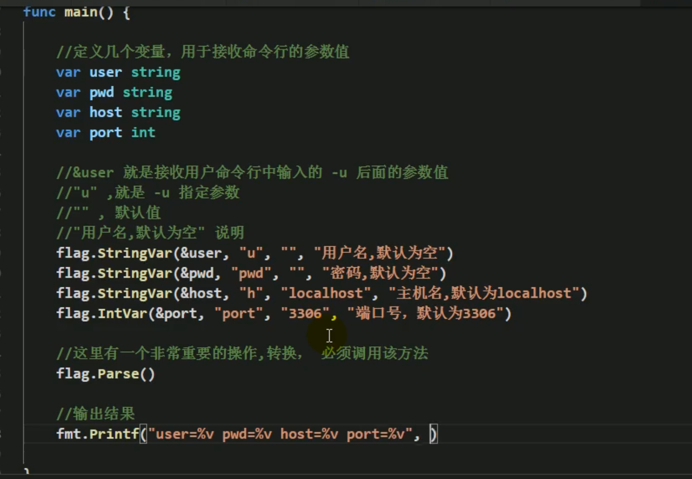
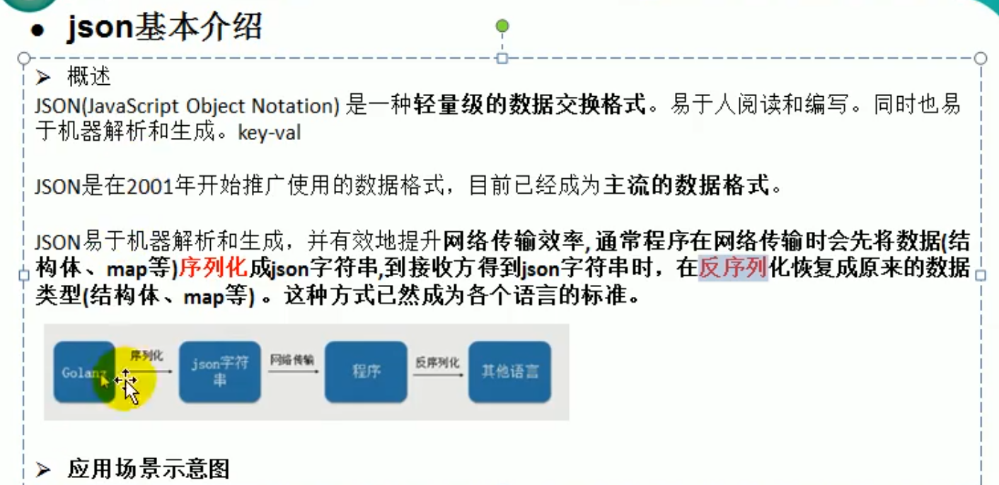
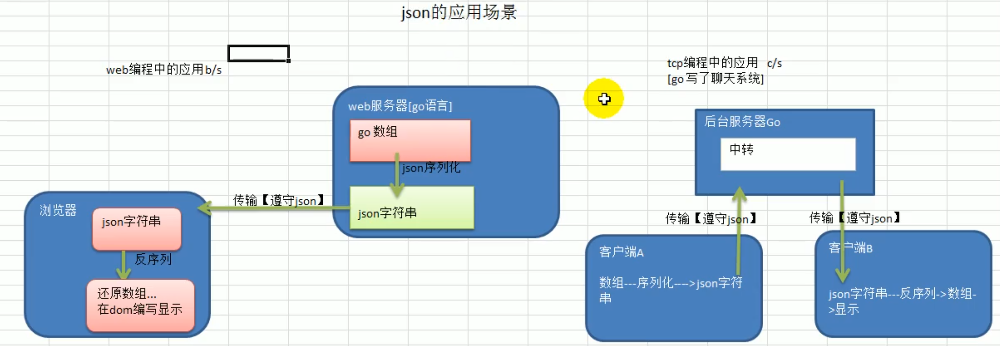
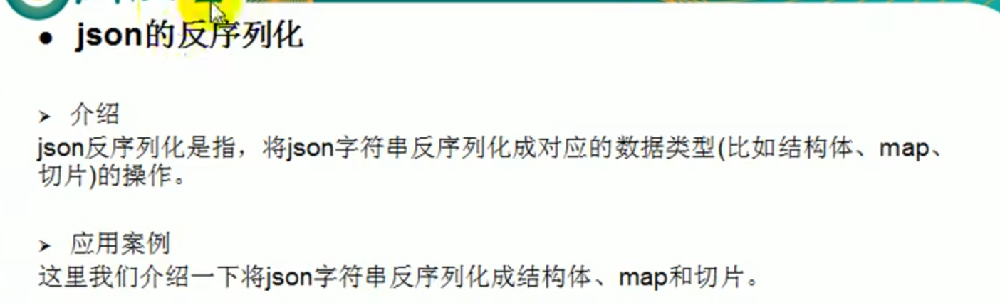
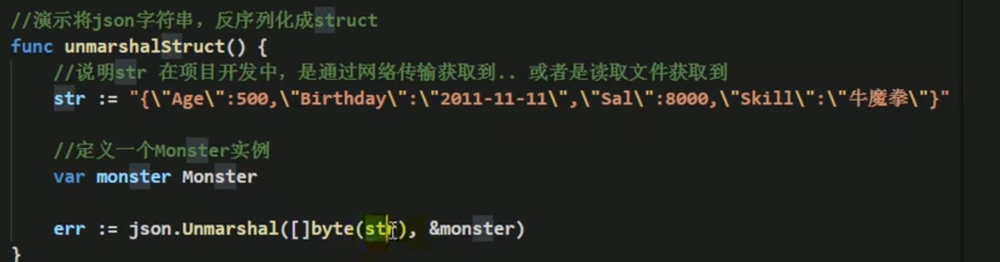

## 命令行参数使用

os.Args全局变量存储参数

## flag包解析命令行参数

解析配置文件

## json介绍和应用场景

## json格式和在线解析

[JSON在线解析及格式化验证 - JSON.cn](https://www.json.cn/#)

## 结构体、map、切片序列化

json.Marshal

## 序列化时tag使用

## 反序列化和应用实例

