## goroutine基本介绍

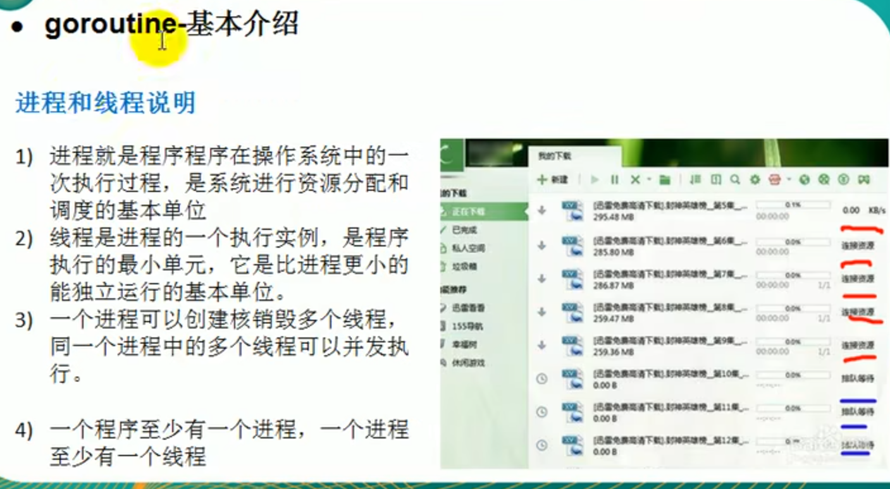go

## go协程与go主线程

## 协程快速入门

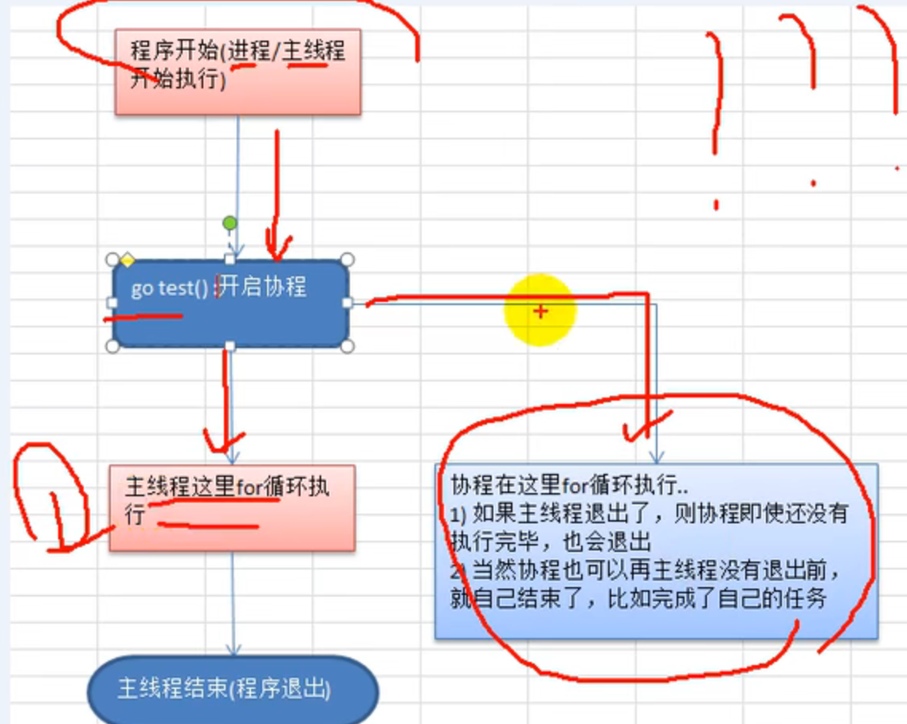

## MPG模式的介绍

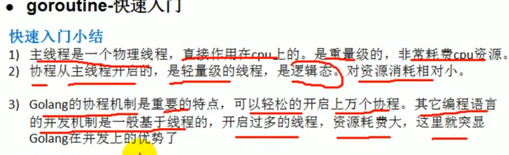

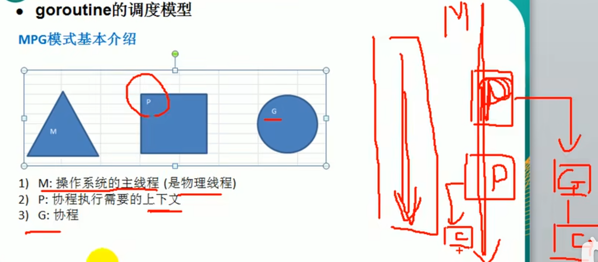

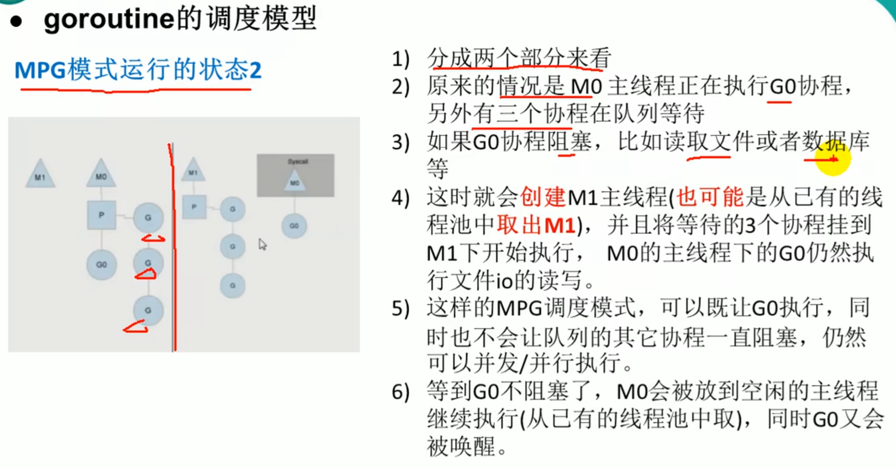

## go设置使用cpu数目

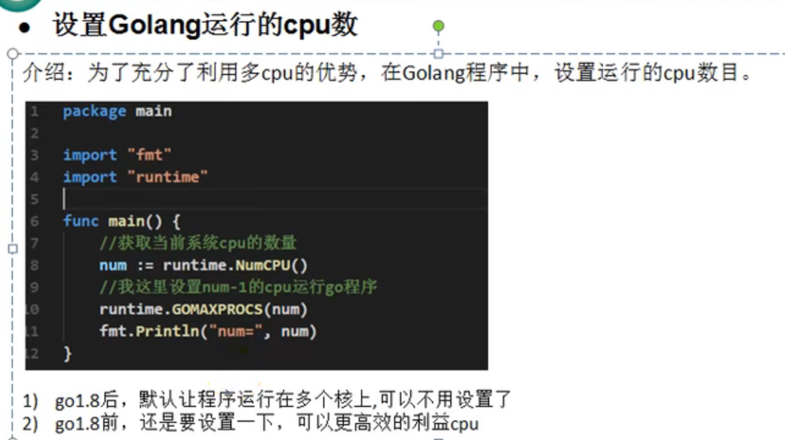

## 协程并发（并行）资源竞争

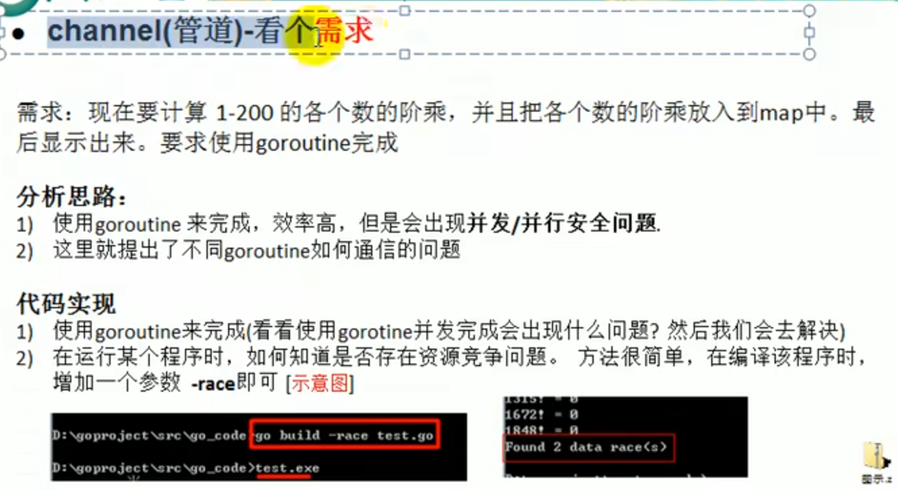

## 全局互斥锁解决资源竞争

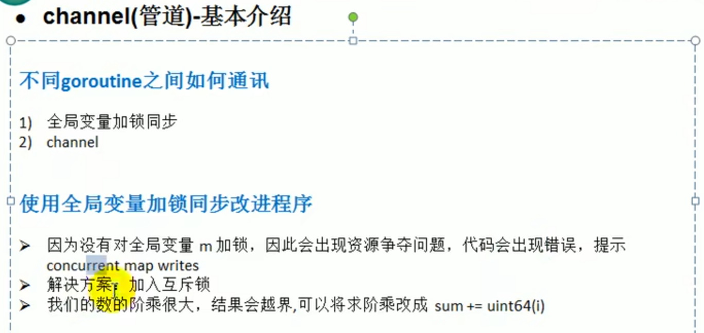

## 管道基本介绍

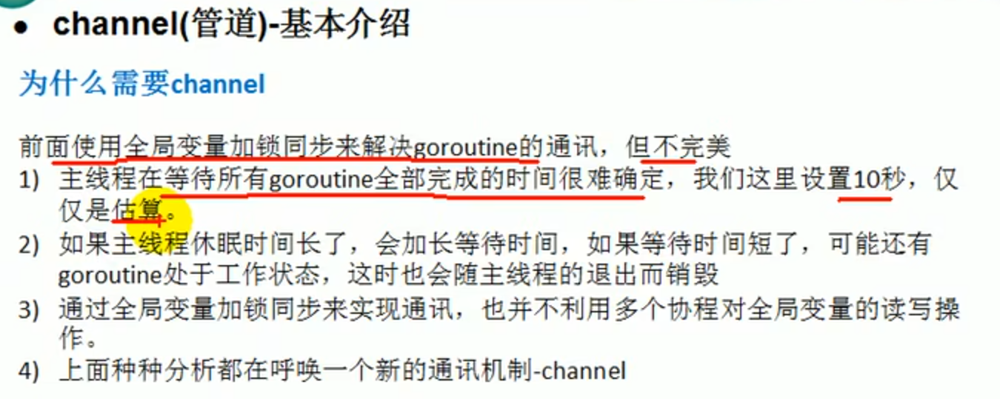

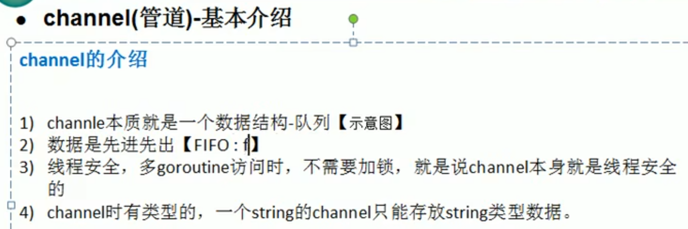

## 管道快速入门

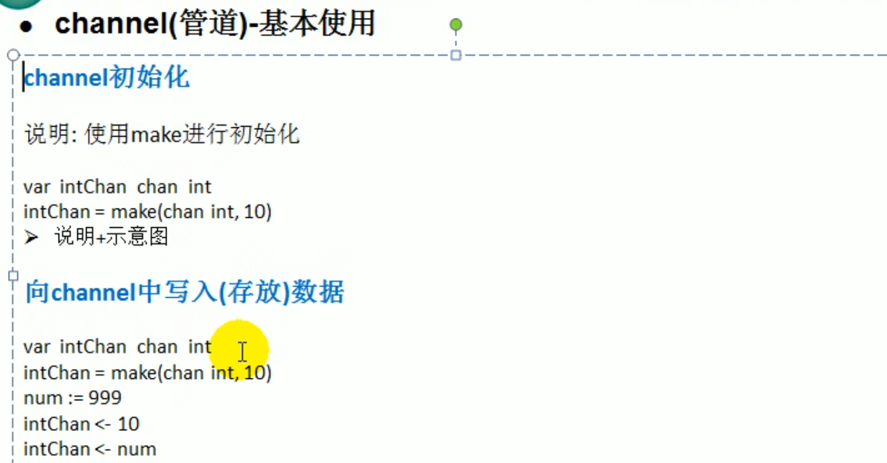

## 管道的细节及课堂练习

## 管道的关闭和遍历

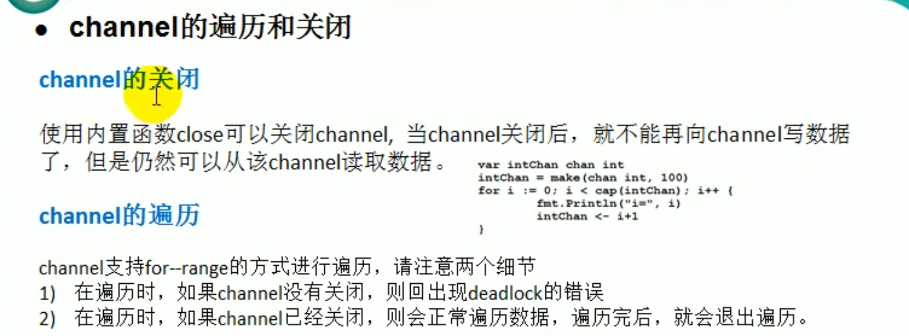

## 协程配合管道的综合案例

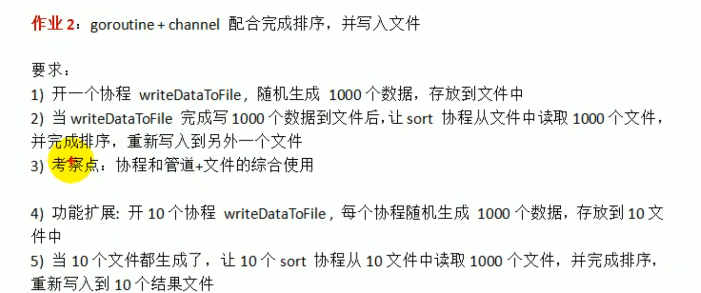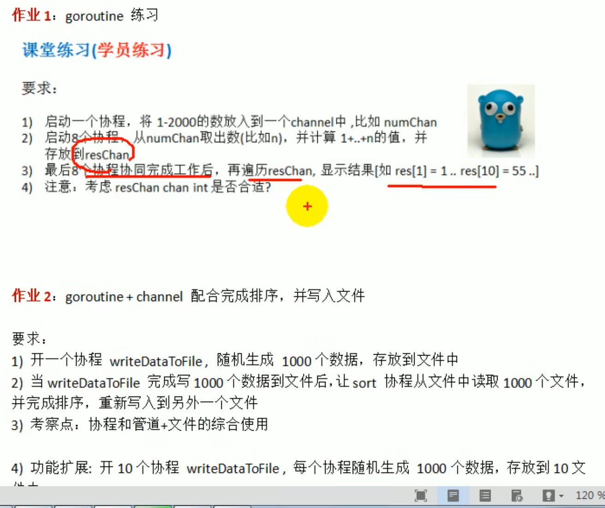

## 管道阻塞的机制

## goroutine和channel的结合

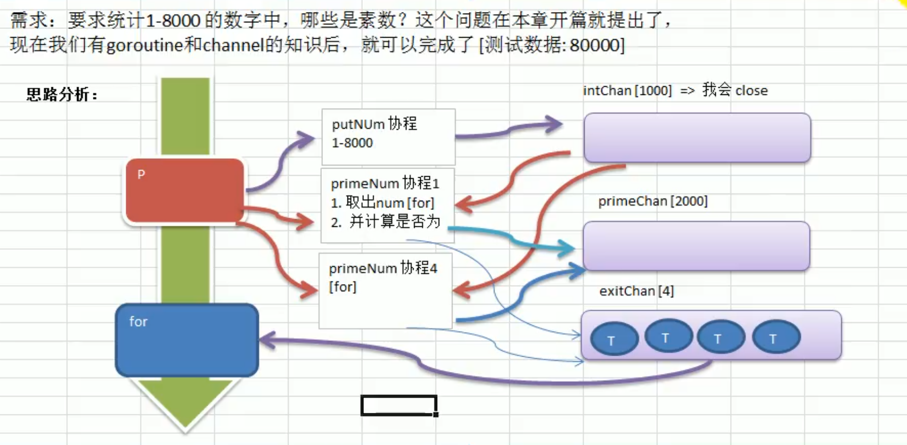

## 协程求素数的代码实现

## 协程求素数的代码效率测试

## 管道的注意事项和细节（1）

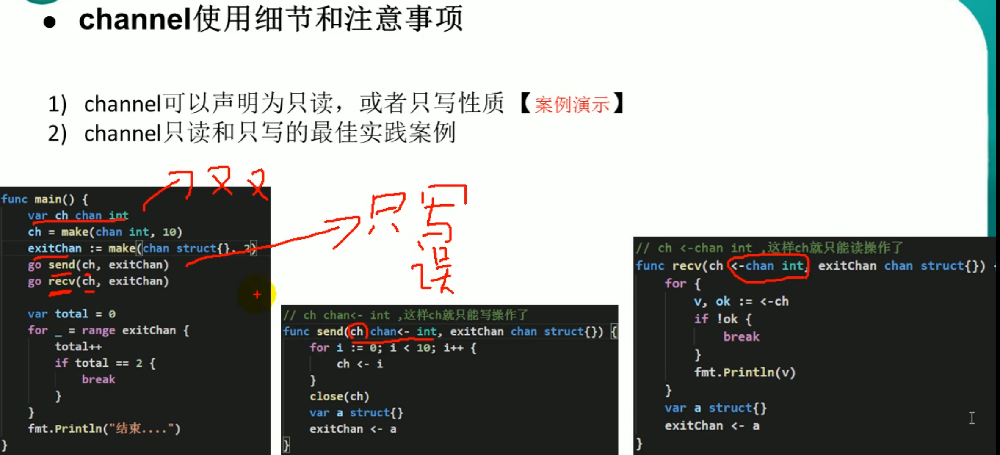

