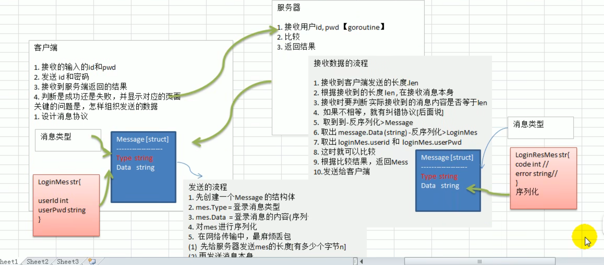

## 完成界面

## 收发消息

## 服务器接收长度

## 完成用户登录

完成客户端可以发送消息本身，服务器端可以正常接收消息，并根据客户端发送的消息（LoginMes），判断用户的合法性，并返回相应的LoginResMes

## 登录（指定用户）

## 服务器端改进

## 客户端改进

## redis用户验证分析

## redis添加用户

## 用户注册

## 用户注册 服务器端

## 显示在线用户

### 实现完成登陆后能返回当前在线用户

### 当一个新用户上线时，其他已经登录的用户也能获取最新在线用户列表

