## 包的概念及用法

 

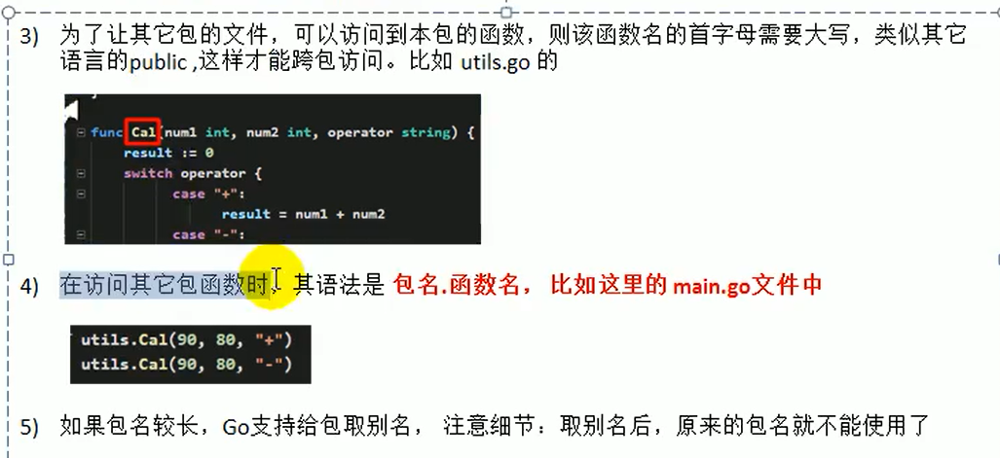

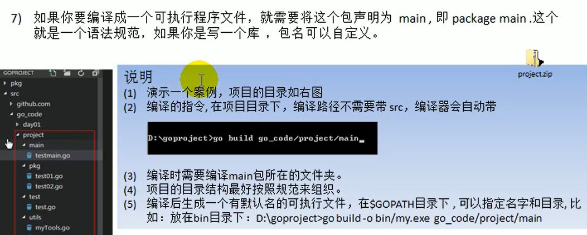

## 函数可加入可变参数

## init函数

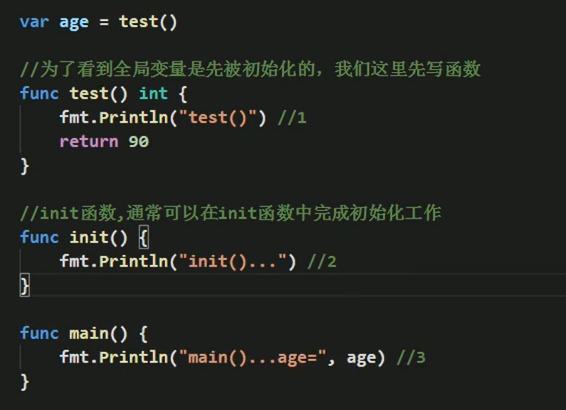

## 匿名函数

- 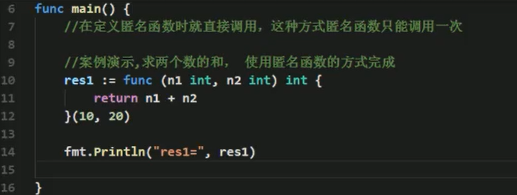

- 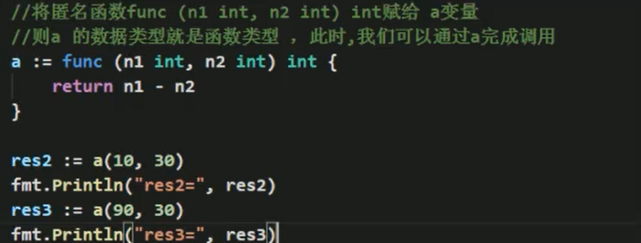
- 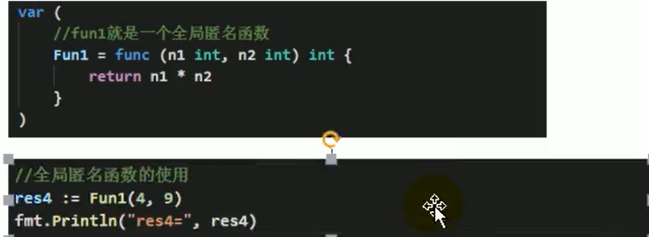## 闭包
- 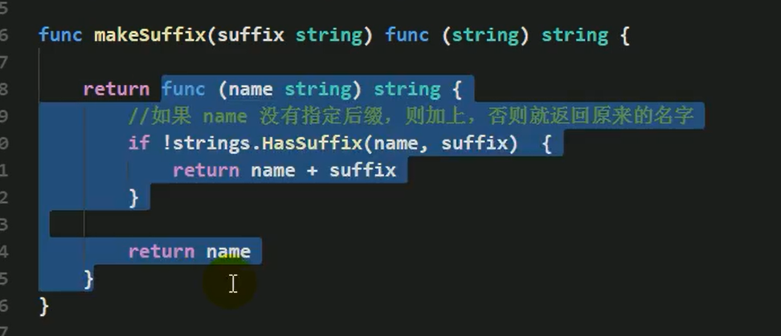
- 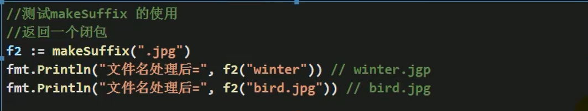defer的使用
- 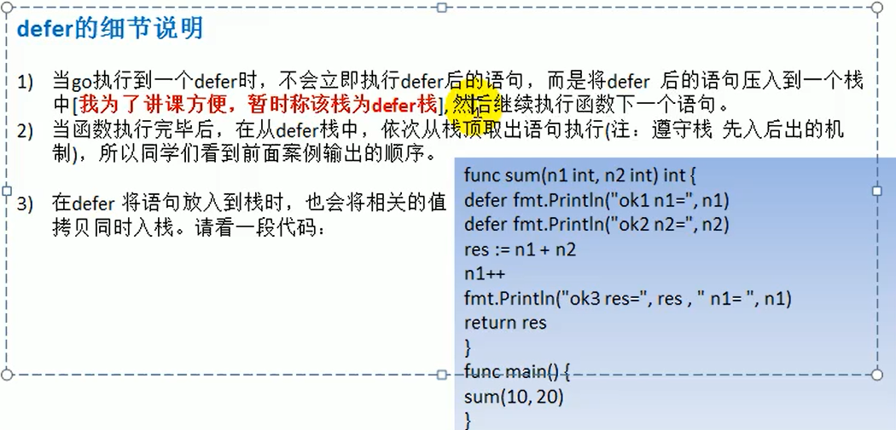
- ## defer的最佳实践
- 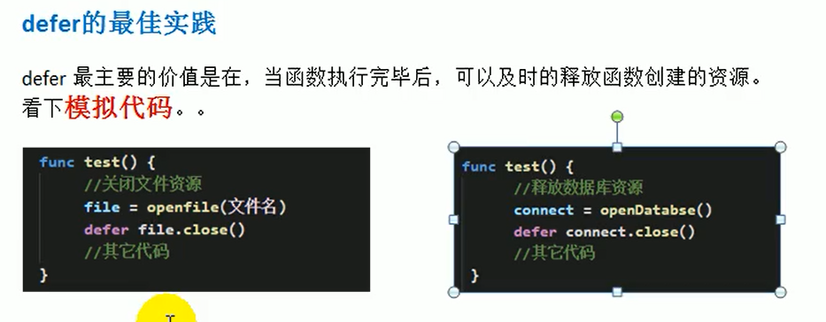
- ## 函数参数的引用
- 
- 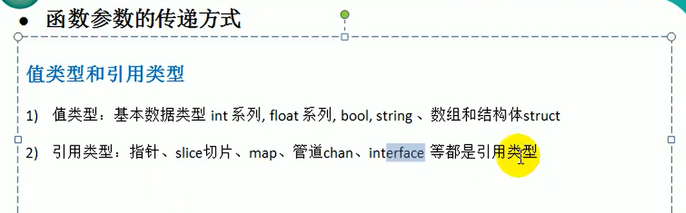
- ## 函数外不能有执行语句
- 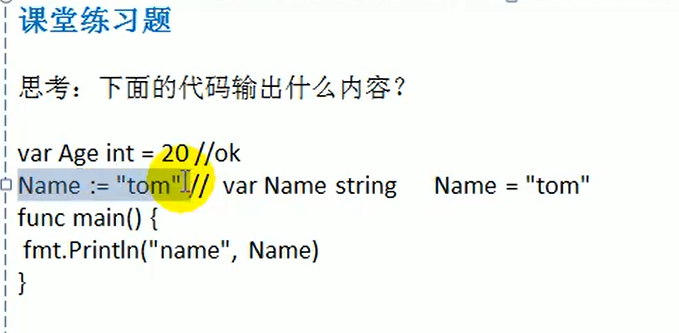
- ## 字符串函数
- 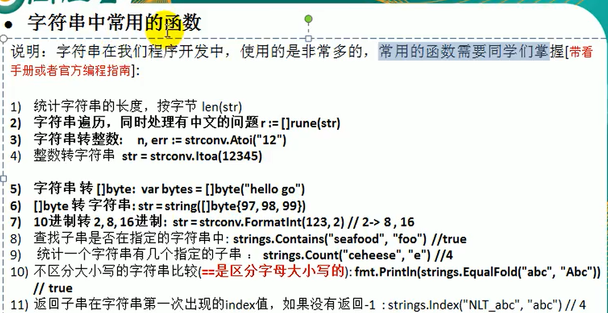
- 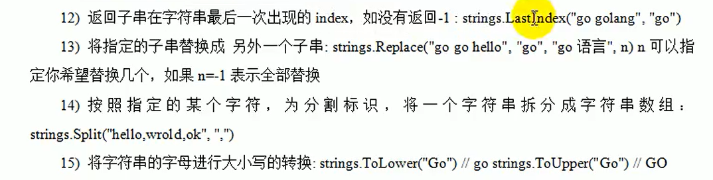
- 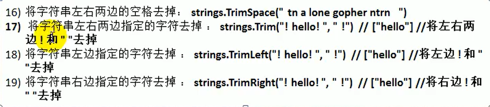
- ## 时间和日期函数（time包）
- 
- 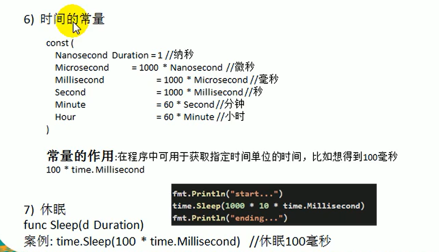
- ## 内置函数（buildin）
- 
- 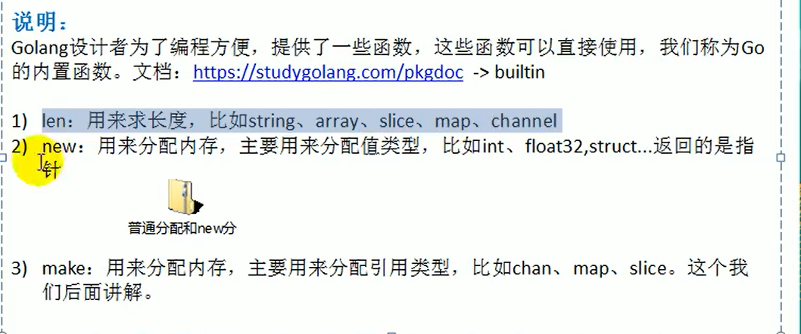
- ## go中错误处理机制
- 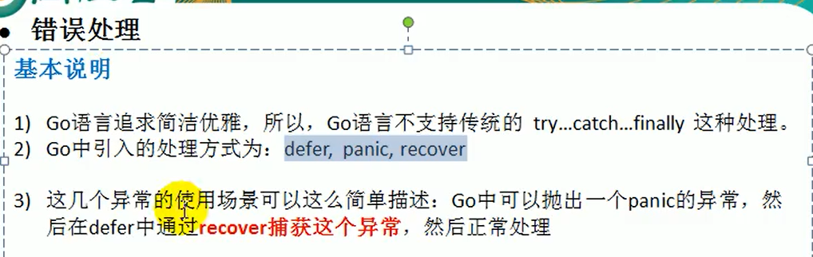
- 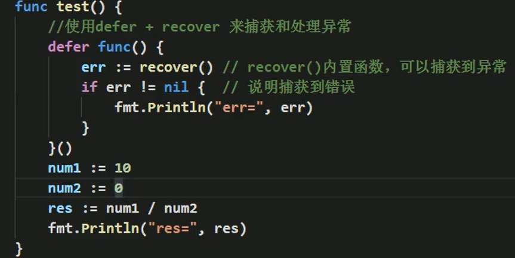
- ## 自定义错误
- 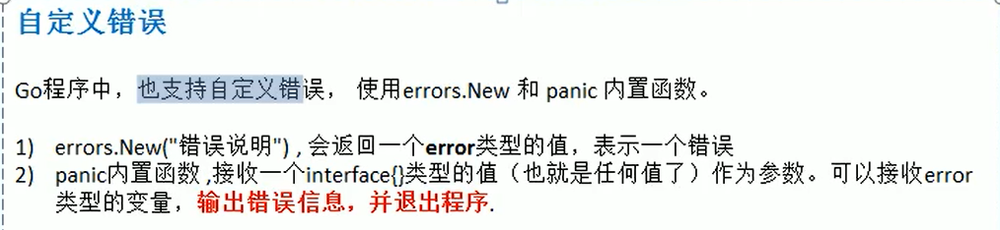
- 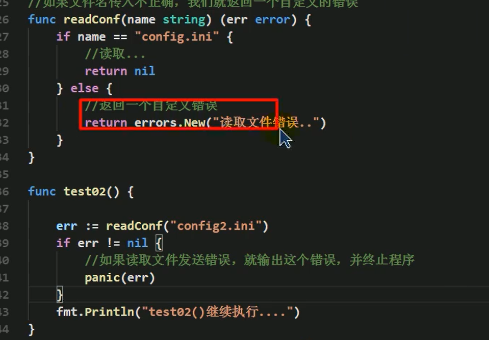
